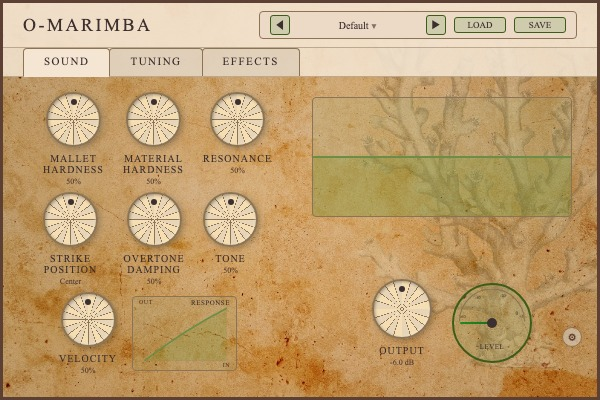
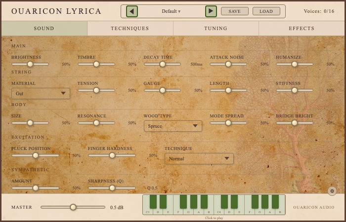
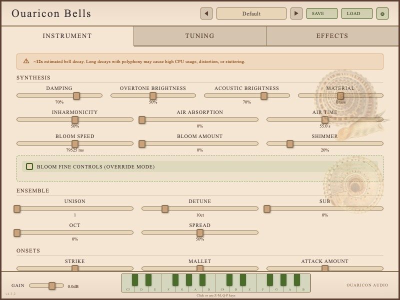

# O-Lyrica / O-Bells / O-Marimba — cross-plugin suite review (260920-a91)

The findings that only exist when the three pages are laid side by side. Per-plugin detail
lives in `260920-a91-REVIEW-O-Marimba.md`, `-O-Lyrica.md` and `-O-Bells.md`; this file does not
repeat it. Nothing under `plugins/` was modified.

## The three at a glance

| | **O-Marimba** | **O-Lyrica** | **O-Bells** |
|---|---|---|---|
| Frame (parsed from `PluginEditor.cpp`) | 600 x 400 | 700 x 450 | **800 x 600** |
| UI root | `Source/ui/public` | `Resources/ui` | `Resources/ui` |
| Tabs | 3 | **4** | 3 |
| States in `tests/i18n-states.json` | 3 (+default) | **15** (+default) | 14 (+default) |
| Frames captured / distinct | 12 / 12 | 26 / 24 | 23 / 23 |
| Shared modules consumed | `effects/analog-eq-unit`, `effects/compressor-unit` | `persistence/preset-manager` | **none** |
| Stub seed | `neutral-defaults` | `neutral-defaults` | `param-dump (65 rows) + overrides` |
| Scrolled tab content (reachable; overlay scrollbar not painted in capture) | 0px | 201px (tuning) | 496px (instrument) |
| Distinct hex colours / greens | 19 / **8** | 14 / 3 | 16 / 5 |
| Declared font sizes (min) | 8 (6px) | 9 (6px) | 10 (6px) |
| `line-height-normal` zh-Hans | 8 | **25** | 19 |
| `check-ui-labels` | PASS | PASS | PASS |
| **P1 / P2 / P3** | **3 / 7 / 7** | **0 / 7 / 7** | **1 / 7 / 7** |

The three default frames, side by side:

| O-Marimba 600x400 | O-Lyrica 700x450 | O-Bells 800x600 |
|---|---|---|
|  |  |  |
| Parchment texture, botanical overlay, radial wooden knobs | Parchment texture, botanical overlay, horizontal range sliders | **Flat cream, no texture**, rect-thumb sliders |

**Batch total: 46 findings — P1 = 4, P2 = 21, P3 = 21.** *Revised 2026-09-20: the three "below the fold" P1s (Lyrica 1–2, Bells 1) were retracted after the user confirmed the shipping WKWebView shows a scrollbar — the tabs scroll; the headless capture never scrolled, so macOS overlay scrollbars never painted. Lyrica 3 lowered to P2.*

## Consistency findings

Same severity and Area vocabulary as the per-plugin files. Each row names which plugins
diverge and **which one is right**.

| # | Severity | Area | Element | What's wrong (measured evidence) | Recommended change |
|---|---|---|---|---|---|
| 1 | P3 *(was P1 — retracted 2026-09-20)* | layout | `.tab-content` overflow | **Retracted.** O-Lyrica `#tuning-tab` (`334/535`) and O-Bells `#instrument-tab` (`449/945`) are scroll regions, and the **shipping WKWebView shows a scrollbar** (user-verified). No scrollbar appeared in the frames because macOS overlay scrollbars paint only during a scroll gesture and the capture walk never scrolled. The residual observation is a design preference, not a defect: O-Marimba and O-Bells' tuning tab fit their frames without scrolling (the latter via a `GENERATE SCALE ▼` disclosure, [`O-Bells/en__06-tuning-generator-open.jpg`](shots/O-Bells/en__06-tuning-generator-open.jpg)); the other two tabs scroll. | Nothing required. If a no-scroll editor is ever wanted, O-Bells' disclosure is the pattern. **Do not add a `scrollHeight <= clientHeight` gate** — scrolling tabs are accepted here. What the harness *should* gain is a scroll-to-bottom frame per scrollable container, so a future batch reviews the scrolled content instead of guessing at it. |
| 2 | P2 | affordance | `#settings-popover` | **All three occlude live UI, and the boxes are near-identical, so it is one copied pattern with one bug.** O-Marimba `168x62` covers `#btn-load-kbm`; O-Lyrica `178x63` covers the reverb `Mix` readout and the EQ `High` knob; O-Bells covers the **EFFECTS tab label** in the tab bar. None has a backdrop, none has a tail, and because `serve-ui`/`measure-ui` click with `force: true` a control underneath is clicked *through* it silently (`pattern_forced_click_under_popover_silent_coverage_hole`). **None is right.** | Fix once, land three times: anchor below a header gear, offset clear of the tab bar, add a `rgba(60,47,47,0.2)` backdrop and a 6px tail. O-Bells already has the correct anchor (finding 4); it needs only the offset and backdrop. |
| 3 | P2 | affordance | `#gear-btn` placement | O-Marimba `(562,327) 20x20` and O-Lyrica `(662,377) 20x20` both put the gear **bottom-right inside `.tab-content`**, floating over live controls and needing `z-index` to stay clickable — and that placement is what forces their popovers to open up-and-left over the panel. O-Bells puts it at `(753,15) 24x24` **in `div.header-bar`**. **O-Bells is right.** | Move both gears into the header beside the preset buttons and raise the hit area to 24x24. This resolves half of finding 2 for free. |
| 4 | P2 | consistency | header title | **Three plugins, three elements, three treatments.** O-Marimba `div.title` 18px `uppercase` ls 2.5px fw 400 → `O-MARIMBA`. O-Lyrica `span.title` 16px `uppercase` ls 2.5px fw 400 → `OUARICON LYRICA`. O-Bells `h1` **22px** `text-transform: none` ls 2px **fw 300** → `Ouaricon Bells`. The brand string itself also differs — `O-<Name>` on one, `Ouaricon <Name>` on two. | Standardise on O-Bells' semantic `h1` with O-Marimba/O-Lyrica's engraved-plate treatment: `uppercase`, `letter-spacing: 2.5px`, `font-weight: 400`, size scaled to the frame (18 / 20 / 22px). Settle the brand string separately — it is a naming decision, not a CSS one. |
| 5 | P2 | consistency | preset strip | Order diverges — **Load(454) then Save(514)** on O-Marimba against **Save then Load** on O-Lyrica (447/511) and O-Bells (613/683). So do the sizes: name box `120x15 @10px` / `120x15 @10px` / **`140x24 @11px`**; arrows `20x20 @10px` / `24x24 @12px` / `24x24 @10px`. **O-Bells is right on sizing** (the only comfortably-tappable arrows and the only readable name box) and the 2-of-3 majority settles the order. | Change O-Marimba to Save-then-Load and adopt O-Bells' `24x24` arrows and `140x24 @11px` name box everywhere. Cheapest convergence: one plugin moves, not two. |
| 6 | P2 | layout | effects-rack knob rows | O-Lyrica and O-Bells both centre **each knob row independently**, so no two rows share a left edge. O-Lyrica containers at `x = 249 / 221 / 129` (knobs at 262/342/422, 234/314/450, 142/222/…/542 — one 80px pitch in three phases). O-Bells at `x = 304 / 266 / 196 / 268`, all centred on 407. Both additionally inject the delay `Mode` select *inside* the knob run, stretching that row out of step. **Neither is right**; O-Marimba's effects tab was never captured (finding 10) so it is unknown. | One shared effects-rack layout: left-align every row to a common column grid anchored on the row with the most knobs, and give the `Mode` select its own slot. Genuinely shared-module-shaped — the two markup trees are already near-identical. |
| 7 | P2 | i18n | tab bar sizing | **Three strategies, one of which breaks.** O-Marimba's tabs are content-sized with no `min-width` and left-clustered: the group ends at `x=299.94` in en and **`x=223.45` in zh-Hans** — a 26% shrink inside a `594px` bar that never changes. O-Lyrica flex-distributes `173.8 x 4` across 694px; O-Bells fixes `265 / 265 / 264`. Both are byte-identical across en/fr/zh-Hans. **O-Lyrica is right** — flex distribution is the only strategy that is both full-width and tab-count-agnostic. | Give O-Marimba's three tabs `flex: 1` across the full bar. A `min-width` pin would also work but is a floor, not a guarantee (`pattern_language_width_pins_content_sized_boxes_move`); flex removes the failure mode instead of raising it. |
| 8 | P3 | consistency | primary control family | O-Marimba: one family — `60x60` radial wooden knobs throughout. O-Lyrica: **two** — `97x6` native `input[type=range]` on SOUND/TECHNIQUES and `44x44` arc knobs on EFFECTS, with `Mix`, `Depth` and `Humanize` existing in both. O-Bells: **two** — custom rect-thumb sliders (`171.5–234 x 8`) and arc knobs. **O-Marimba is right** on coherence; its knob is also the strongest identity element in the batch. | State the rule rather than convert 60 controls: *sliders for continuous timbre parameters, knobs for effect sends*. Then the two-family split is a documented decision instead of an accident, and the next plugin does not have to guess. |
| 9 | P3 | consistency | language control | O-Marimba and O-Bells use a native `<select>` (`#lang-select`, `71x19` and `≈80x20`); O-Lyrica uses a **custom button** (`#lang-select` `(619,317) 51x18`, `background: rgb(232,213,183)`, no disclosure affordance). Same job, two control types, and only one of them announces that it opens a list. **The `<select>` is right** — majority, plus native keyboard and screen-reader behaviour. | Convert O-Lyrica's button to a `<select>` styled to match, or at minimum give it a `▼`. |
| 10 | P3 | colour | accent palette | Green is the de-facto house accent but nobody agrees how much of it. O-Marimba: **8 distinct greens** in 19 hexes. O-Lyrica: 3 in 14. O-Bells: 5 in 16 — **against a brief that names "warm amber, bronze, cream, aged gold"** and uses its own gold `rgb(184,134,11)` on exactly 2 surfaces versus 28 green ones. **`#8BC34A` (Material Design Light Green 500) is hard-coded in all three** — a stock framework colour in three hand-built palettes. | Define three greens as CSS custom properties (active / border / fill) in a shared stylesheet and delete the rest; `#8BC34A` goes first, in all three. O-Bells is a separate decision — either re-skin it to its brief's gold or correct the brief, but the two cannot keep disagreeing. |

## Shared-module opportunities

Grounded in what was measured, not in what could exist.

**The starting fact is more interesting than expected.** `modules/ui/instrument-footer-panel`
and `modules/ui/playable-keyboard` both exist, and a grep of **every** `plugins/*/CMakeLists.txt`
in the repo finds **zero consumers of either**. But `instrument-footer-panel/README.md` explains
why, in its own words:

> **IMPORTANT:** Based on real-world integration experience (**O-Bells v2.2.0**), the
> **surgical integration** approach works better than importing the standalone JS module.

So the module is documented as a *copy-the-snippets pattern*, not a linked dependency. Zero
consumers is the designed outcome, not neglect — and that changes the recommendation.

| Candidate | What the three do today | Does the module cover it? | Cost of adopting |
|---|---|---|---|
| **Footer panel** (master + keyboard + branding) | O-Lyrica `div.footer (3,392) 694x55` and O-Bells both ship exactly the module's `Left: Master / Center: Keyboard / Right: Branding` table. **O-Marimba has no footer at all** — no master control, and its keyboard is a `280x70` single-octave widget stranded inside the tuning tab. | Yes, and two of three already match it by surgical integration. | **Low for O-Marimba, zero for the other two.** The real gap is that O-Marimba never adopted the pattern. |
| **Playable keyboard** | O-Lyrica and O-Bells both render `14` white keys `C3…B4` (2 octaves) in the footer. O-Marimba renders `12` keys, 1 octave, `280x70`, in-panel — and its brief specifies **"2-octave keyboard visualization (400px)"**, so it diverges from its own spec *and* from its siblings. Only O-Bells tells the user the computer keyboard works (*"Click or use Z-M, Q-P keys"*). | Yes — the module offers 1–5 octaves, QWERTY mapping and pitch-circle integration, which is a superset of all three. | **Low.** This is the one place a genuine link (`ouaricon_add_module`) would pay, because three implementations of key geometry and note mapping already exist and two agree. |
| **Preset strip** | Three near-identical clusters (`◀` / name / `▶` / two buttons) that disagree on button order, arrow size and name-box size — consistency finding 5. Only O-Lyrica consumes `persistence/preset-manager`, and that is the **C++** half (`modules/persistence/preset-manager/cpp`); the markup is hand-rolled in all three. | **No module exists for the UI half.** | **Medium.** Worth extracting *after* finding 5 settles the order and sizing — extracting a component whose three call sites still disagree just freezes the disagreement. |
| **Settings popover** | Boxes of `168x62`, `178x63` and `≈200x65` with the same two rows (Language, Hover help). Clearly one pattern copied three times — and the occlusion bug (finding 2) copied with it. | No. | **Low, and the highest payoff per line.** Three call sites, near-identical geometry, one shared bug. Extract this before the preset strip. |
| **Effects rack** | O-Lyrica and O-Bells ship recognisably the same four-section rack (Chorus / Delay / Reverb / EQ, arc knobs, right-aligned bypass, a `Mode` select inside the delay row) with the same alignment defect (finding 6). O-Marimba instead links `effects/analog-eq-unit` + `effects/compressor-unit` — a different decomposition entirely. | Partially — the existing effects modules are per-unit, not a rack layout. | **Medium–high.** Do not propose the extraction yet: O-Marimba's effects tab was never rendered (see Carried blindnesses), so only two of three call sites have actually been compared. |

**Do not extract anything whose three call sites have not been compared.** That rules out the
effects rack for now and is the reason the preset strip is sequenced after finding 5.

## i18n and width pinning

All three ship `['en', 'fr', 'zh-Hans']`, and all three pass `check-ui-labels` with **zero**
clipping and zero label collisions in every language. The problems are not overflow.

**The `line-height-normal` census, which is where the real exposure is:**

| Plugin | zh-Hans findings | Includes | `wrap-count` nodes ESTIMATED at `fsn * 1.2` |
|---|---|---|---|
| O-Marimba | **8** | all 3 tab labels, both preset arrows, both tonic arrows, the gear | 59 of 90 (66%) |
| O-Lyrica | **25** | all 4 tab labels, all 16 effect value readouts at 9px | 266 of 386 (69%) |
| O-Bells | **19** | all 3 tab labels, 16 effect readouts at 9px | 445 of 589 (76%) |

**52 nodes across the batch resolve `line-height: normal`, and every plugin's tab labels are
among them.** Those boxes take their height from whichever CJK face the UA resolves, so the
stylesheet does not control them — and each one also forces `wrap-count` to *estimate* rather
than measure, which is why 66–76% of the compared nodes in this batch are estimates. One
shared fix: an explicit `line-height: 1.1` on `.tab`, `.knob-value` and `.slider-value` in all
three. It repairs the geometry and the measurability together.

**Chinese failures here are shrinks, not overflows, and a pin is a floor.** O-Marimba is the
only plugin whose geometry moves between languages, and it moves the wrong way: the tab group
contracts from `299.94px` to `223.45px` (compare
[`O-Marimba/en__00-default.jpg`](shots/O-Marimba/en__00-default.jpg) with
[`O-Marimba/zh-Hans__00-default.jpg`](shots/O-Marimba/zh-Hans__00-default.jpg)) inside a bar
that stays `594px`. The counter-example is on the same page: its tuning-mode buttons
`#btn-12tet` / `#btn-scala` / `#btn-mts` are pinned at exactly `60x27` and hold
`12-TET / CUSTOM / MTS-ESP`, `12-TET / PERSO / MTS-ESP` and `12-TET / 自定义 / MTS-ESP` without
moving a pixel. Pinning works — but per
`pattern_language_width_pins_content_sized_boxes_move` a `min-width` is a floor, so an
"already pinned" element is not safe against a future language. Flex distribution (finding 7)
removes the failure mode rather than raising its threshold.

**French is the language paying for fixed boxes**, in all three plugins: `CHARG.` / `ENREG.` /
`OUVRIR` in preset and file buttons, `AMORT. HARMON.`, `BRILL. CHEVALET`, `DÉSACC.`, and
O-Marimba's `CHARG. .SCL` — an abbreviation period immediately followed by an extension
period. Chinese needs no abbreviation anywhere. Every case traces to a button pinned between
`43px` and `56px` at 7–9px, and every one has free header or panel width beside it.

## Recommended sequencing

*Revised 2026-09-20 — the former items 1–2 (surface below-the-fold content; add a no-overflow gate) were retracted: the tabs scroll and the shipping WKWebView shows a scrollbar.* Items marked **[shared]** are fix-once-land-three-times.

| # | Do this | Why first | Where |
|---|---|---|---|
| 1 | **Settle O-Bells' accent colour** — re-skin to the brief's aged gold, or correct the brief | The single highest-impact visual decision in the batch: 28 green surfaces against 2 gold on a plugin whose brief names no green. It is one decision, and it blocks any shared-palette work. | Bells 2; SUITE 10 |
| 2 | **Move both stray gears into the header and fix the popover once [shared]** | Three plugins, one copied pattern, one copied occlusion bug — and O-Bells already has the right anchor to copy. Resolves 6 per-plugin findings. | SUITE 2–3; Marimba 7/11; Lyrica 7/11; Bells 7 |
| 3 | **`line-height: 1.1` on `.tab`, `.knob-value`, `.slider-value` [shared]** | Clears all 52 zh-Hans findings and makes 66–76% of `wrap-count`'s nodes measurable instead of estimated. Three one-line CSS edits. | SUITE i18n; Marimba 11; Lyrica 4; Bells 9 |
| 4 | **Fix O-Lyrica's footer / tab overlap** | `div.footer` paints over the bottom 15px of every tab; the last row of a scrolled tab lands under it. One height change. | Lyrica 3 |
| 5 | **Flex-distribute O-Marimba's tab bar** | The only language-dependent geometry in the batch; O-Lyrica already ships the fix. | SUITE 7; Marimba 3 |
| 6 | **Raise the type floor to 8–9px and delete the one-off sizes [shared]** | Every plugin declares 6px text; O-Bells does it on an 800x600 frame with 131px of empty space. Purely additive legibility. | Marimba 1/14; Lyrica 10; Bells 14 |
| 7 | **Widen the French-abbreviated buttons [shared]** | `CHARG. .SCL` reads as broken text. Every case has free width beside it; no layout risk. | SUITE i18n; Marimba 2/10; Lyrica 9 |
| 8 | **Teach `shoot-ui.js` to capture a scrolled-to-bottom frame per scrollable container** | This batch never saw the scrolled half of two tabs and mis-called it as hidden. Cheap, and it makes every later batch honest. | SUITE 1; Carried blindness 2 |
| 9 | **One shared effects-rack column grid [shared, blocked]** | Two of three call sites compared and both wrong the same way — but hold until O-Marimba's effects tab has actually been rendered. | SUITE 6; Lyrica 5; Bells 4 |
| 10 | **Converge the preset strip and header title** | Real inconsistency, lowest user cost. Do it after 1–9 so the extraction in the next batch has agreeing call sites to work from. | SUITE 4–5 |

## Carried blindnesses

What this batch could **not** see. A later batch reads this to know what it still owes.

1. **O-Marimba's EFFECTS tab was never opened.** `tests/i18n-states.json` has three states and
   none clicks `#tab-effects`; the census confirms no `#effects-tab` in the visible-node set.
   **A third of the plugin is unreviewed, not clean** — and it is the reason SUITE finding 6
   and sequencing item 9 are blocked at two of three call sites.
2. **The capture walk never scrolled, so scrolled content was never seen and overlay
   scrollbars never painted.** O-Lyrica's generator form (`#generator-inputs`: `Start
   HarmonicEnd Harmonic`, `Generator (¢)Period (¢)Notes`) and O-Bells' Advanced / Envelope /
   Filter / Performance / Output sections were measured but not looked at. This blindness
   produced three false P1s in the first draft ("hidden below the fold") — `scrollHeight >
   clientHeight` in a headless frame means *scrollable*, not *hidden*. Sequencing item 8.
3. **Slider values on O-Marimba and O-Lyrica are fixtures**, not shipped defaults — both seed
   `neutral-defaults` with the default at the middle. Only O-Bells has real defaults (and even
   there the *ranges* are still normalised `0..1`). No finding in the batch rests on a value
   except O-Bells 11, which is flagged.
4. **Nothing here proves a control is wired.** The generic stub does not reject unknown native
   function names; it infers a benign value and records the gap. No "dead control" finding was
   made or can be made from this harness.
5. **`scripts/ui-stub/generic-juce-stub.js:116` hard-codes `rangesFrom: 'neutral-defaults'`**
   and never reads `window.__stubOverrides`, so it misreports O-Bells. The authoritative value
   is `stubSeed().__from`. A harness defect in `scripts/`, deliberately not fixed by this
   read-only review — but a later batch that trusts that field will be misled.
6. **O-Lyrica's `TONIC: undefined` is a harness artefact**, evidenced by O-Bells supplying
   `getTonicNote` as a native override and rendering `C` correctly while O-Lyrica supplies no
   natives at all. Whether the shipped plugin does the same is unknown and worth one check.
7. **States never reached:** 3 `#generator-type` `<option>`s on O-Lyrica, 5 `<option>`s on
   O-Bells (both reported by `check-ui-labels` coverage), and O-Bells' `#C0392B` alert state,
   which appears 4 times in the CSS and rendered in none of the 61 frames.
8. **Colour judgement here is computed-style only.** Hex values, alphas and usage counts are
   measured; **no perceptual contrast ratio was computed** for any text-on-background pair. The
   low-contrast claims (O-Lyrica 8, O-Bells 6) are composition judgements from the frames, not
   WCAG numbers.
9. **No plugin was rendered in a DAW.** Everything is headless Chromium at the parsed frame.
   Host-scaled AU/VST3 rendering, retina behaviour and the 6–7px text at real Logic window
   scale were not observed — which is precisely where sequencing item 7 matters most.
10. **3 of 43 plugins.** This batch covered three. The suite-wide review it opens still owes
    the other 40, and the harness (`shoot-ui.js`, committed beside this file) is what makes the
    next batch cheap.
